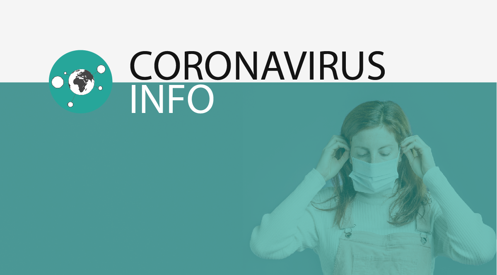

<h1>Coronavirus Info</h1>

<b>Coronavirus Info</b> is a mobile application developed for purposes of HackCrisis hackathon taking place between 18.03.2020 and 22.03.2020. 
Partnered by GovTech Polska, Google, Amazon, Microsoft and many others, event handled the topic of existent at that time SARS-CoV-2 virus disease.
It enables users to track the spread of caused by the virus COVID-19.

Main features available in the application are:

- Map of current disease spread, number of confirmed cases (based on WHO data)
- current news from Poland and other countries, from various well known media providers
- articles explaining basic facts about virus itself, as well biological-wise and epidemiological-wise
- tips about protection, comments on various fake-information spreading on the Internet, as well about some marketing abuses
- list of current statements and regulations introduced by official/government subjects

Application also notifies user about the most important events regarding the disease and research on virus as well as about new government regulations.

All content is based on official sources (except press news).

Solution is quite scalable, as all used infrastructure can be adjusted or changed to suit more workload. Data and content fetching are automated, however there is also a possibility for manual input of e.g. notifications at special website.

The project has been developed thanks to the following team:

<i>Tomasz Słuszniak</i> - team leader, Android developer  
<i>Illia Herman</i> - Android developer  
<i>Karol Radziszewski</i> - Python developer, data analyst  
<i>Damian Ćwiek</i> - Android developer  
<i>Joanna Pudełko</i> - Graphics, promotion materials  
<i>Karol Dubrawski</i> - Public Relations, copywriting  
<i>Karolina Markusiewicz</i> - content supervising  

